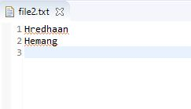
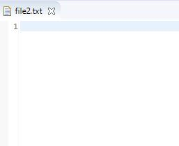

# Copy Names
## Description

### Objective:

To work with files.

#### Scenario:

Manish started working with I/O in Java. Now, Manish wants to copy the names from file1.txt to file2.txt, whose name starts with the given character. Help Manish to write a Java code to count the names copied from one file to another.

Assume the given character must be in upper case.

**Note:**

- If names starting with the given character are present in file1.txt, count them and display the output as` "<count> names are added to the file2"`, otherwise display `"No names found"`.
- Do not edit or delete the codes provided in the code template.
- Adhere to the Sample Inputs/ Outputs.

# Sample Input1:

Enter the starting character

H

# Sample Output1:

2 names are added to the file2

Eg: file2.txt Output

# Sample Input2:

Enter the starting character

Z

# Sample Output2:

No names found

Eg: file2.txt Output (is empty)
