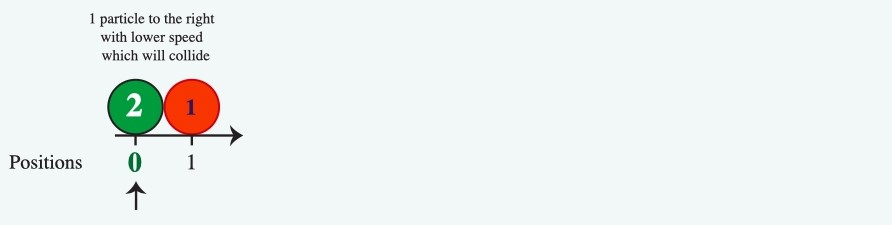
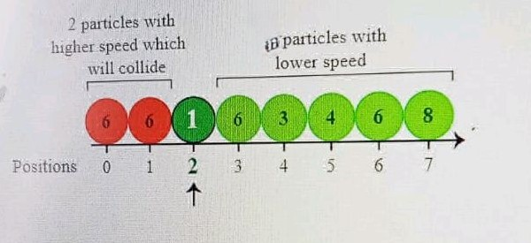

# Particle Collision Problem

## Problem Description

There are `n` particles numbered from `0` to `n-1` lined up from smallest to largest ID along the x-axis. For example:

Positions: 0 1 2 3 4 5 ... n-1

The particles are all released simultaneously. Once released, each particle travels indefinitely in a straight line along the positive x-axis at a speed. When two particles collide, the faster particle moves through the slower particle and they both continue moving without changing speed or direction. Given a list of particle speeds for particles arranged left to right by position, determine the number of collisions that occur with the particle that starts at index `pos`.

## Example

### Example 1

n = 2
speed = [2, 1]
pos = 0

1 particle to the right with a lower speed which will collide.

**Positions**

0 1

Speeds are labeled on the particles. Particle 0 starts at position 0 on the axis and travels right at `speed[0] = 2` units per second. At seconds 0 through 3, it is at positions `[0, 2, 4, 6]`.

Particle 1 starts at position 1 on the axis and travels right at `speed[1] = 1` unit per second. At seconds 0 through 3, it is at positions `[1, 2, 3, 4]`.

Since both particles are at position 2 at the same time, they collide. Particle 0 continues to outpace particle 1 indefinitely so they never collide again. There is one collision that occurs.

## Function Description

Complete the function `collision` in the editor below.

The function has the following parameters:
- `int speed[n]`: each `speed[i]` indicates the speed of particle `i`.
- `int pos`: index of the particle to count collisions for.

Return:
- `int`: the number of collisions occurring with particle `pos`.

### Constraints

- `1 ≤ n ≤ 10^5`
- `1 ≤ speed[i] ≤ 10^9`
- `0 ≤ pos < n`

## Input Format for Custom Testing

Input from stdin will be processed as follows and passed to the function.

- The first line contains an integer `n`, the number of particles.
- The next `n` lines each contain an element `speed[i]` where `0 ≤ i < n`.
- The next line contains an integer, `pos`.

## Sample Cases

### Sample Case 0

#### Sample Input 0

8
6
6
1
6
3
4
6
8
2

#### Sample Output 0

#### Explanation 0

n = 8
speed = [6, 6, 1, 6, 3, 4, 6, 8]
pos = 2

2 particles with higher speed will collide.

No particles with lower speed.

**Positions**

0 1 2 3 4 5 6 7
↑

The particles at positions 0 and 1 are moving faster than the one at `pos = 2` so they will collide with the particle.

The particle at position `pos = 2` is moving slower than the particles at positions 3, 4, 5, 6, and 7, so it will never catch up with them.

### Sample Case 1

#### Sample Input 1

10
8
3
6
3
2
2
4
8
1
6
7

#### Sample Output 1

#### Explanation 1

n = 10
speed = [8, 3, 6, 3, 2, 2, 4, 8, 1, 6]
pos = 7

The particle at position `pos = 7` will only collide with particles 8 and 9 as it passes them from behind. There are no other particles moving fast enough to collide with particle 7.

### Sample Case 2

#### Sample Input 2

6
1
3
7
4
6
4
3

#### Sample Output 2

#### Explanation 2

n = 6
speed = [1, 3, 7, 4, 6, 4]
pos = 3

1 particle with a higher speed will collide.

No particles with lower speed.

**Positions**

0 1 2 3 4 5
↑

Particles 0 and 1 are moving slower, so they will never catch up. Particle 3 is moving at less than or equal to the speeds of particles ahead of it, numbers 4 and 5, so it can never catch up. The only collision with particle 3 occurs with particle 2.
