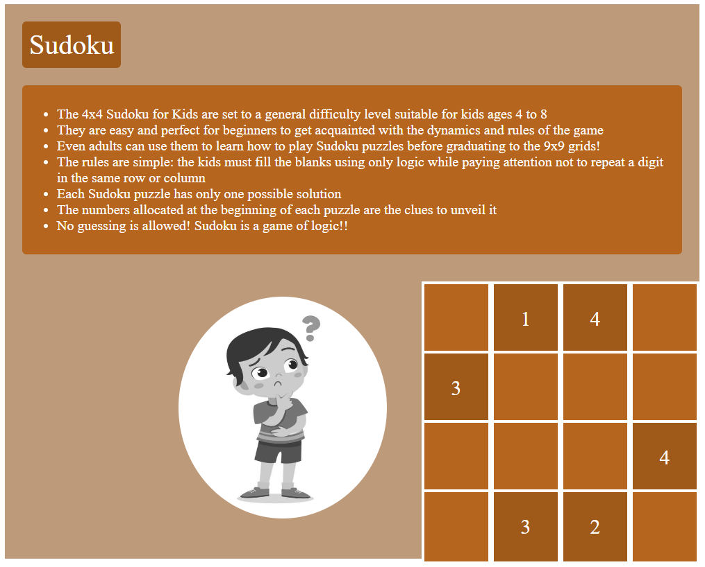

# 4*4 Sudoku 

## Description                            

### Objective:

To work with CSS Selectors, Flexbox, Positioning, and Pseudo classes.

#### Problem Description:

Apply styles to the web page with information on 4*4 Sudoku, that has already been created for you, adhering to the requirements specified.  

#### Styling using Element Selector : 
#### Styles applied to img : 
The `border radius` must be set to `50%`, and the `left margin` must be set to`250px`. 

#### Styling using Class Selector :
#### Styles applied to the element with class heading: 
The heading must `float to left` and the `border radius` must be set to `6px`. 
Set its `padding and margin to 10px and 25px`, respectively. 

#### Styles applied to the element with class desc:
The description must `clear itself to the left`, in the `next line of the heading`, and its `border radius` too must be set to `6px`. 
Set its `padding and margin to 10px and 25px`, respectively. 

#### Styles applied to the element with class container: 
Set the container as a `flexible item`, and `wrap the same`. 

#### Styles applied to the element with class row: 
Set the `width and height` of the element with `class row to 100% and 25%`, respectively. 
Set the `display` property of the `element to flex`, to enable `flexbox layout`. 

#### Styles applied to the element with class box: 
Set the `width and height` of the element with `class box to 400px and 100px`, respectively. 
Set the display property of the `element to flex, to enable flexbox layout`. 
`Justify` the box content and align the items in it to the `center`. 

#### Styles applied to the element with class relative: 
`Position` the element in `relative` manner. 
Set the `width and height` of the element with class - relative to `1000px and 800px`, respectively. 

#### Styles applied to the element with class absolute: 
`Position` the element in `absolute` manner. 
Set the `top and right` attributes of the element with class - `absolute to 400px and 0px`, respectively. 

#### Style applied to the img element with pseudo-classes - :hover 
When the `mouse pointer hovers` over the image, the image must show itself in `100% greyscale`. 

Web page after applying all the `styles & on hovering over the image`, will look like below :

