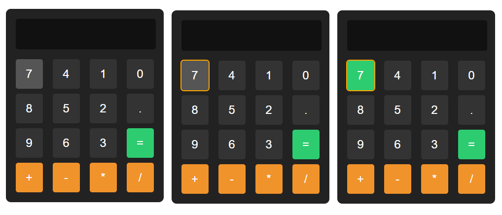

Calculator
Description

                                                                                                                      Calculator 

Objective:

To work with CSS Selectors, Flexbox, and Grid Layouts.

Problem Description:

Apply styles to the web page with a simple Calculator that has already been created for you,
adhering to the requirements specified.  

Styling using Class Selector : 

Styles applied to element with class - container : 
Set the container element with a flexbox layout. 
Center align the items within the flex container along the horizontal axis and vertical axis.

Styles applied to element with class - buttons : 
Set the container element to use a grid layout.
The layout should have 4 columns, each with a width of 55 pixels. 
The gap between columns must be set to 20 pixels.

Styles applied to element with class - row : 
Set the container element to use a grid layout. 
Specify the gap between the rows to be 10 pixels.

Styles applied to the button element with various pseudo-classes :
When the mouse pointer hovers (:hover) over the button, the background color of the button must be set to #555555.
When the button is clicked (:active), the background color of the button must be set to #2ecc71.
When the button receives focus (:focus), then the outline that appears around the button must be set to "2px solid orange"

On hovering, On focus, When active/clicked :

