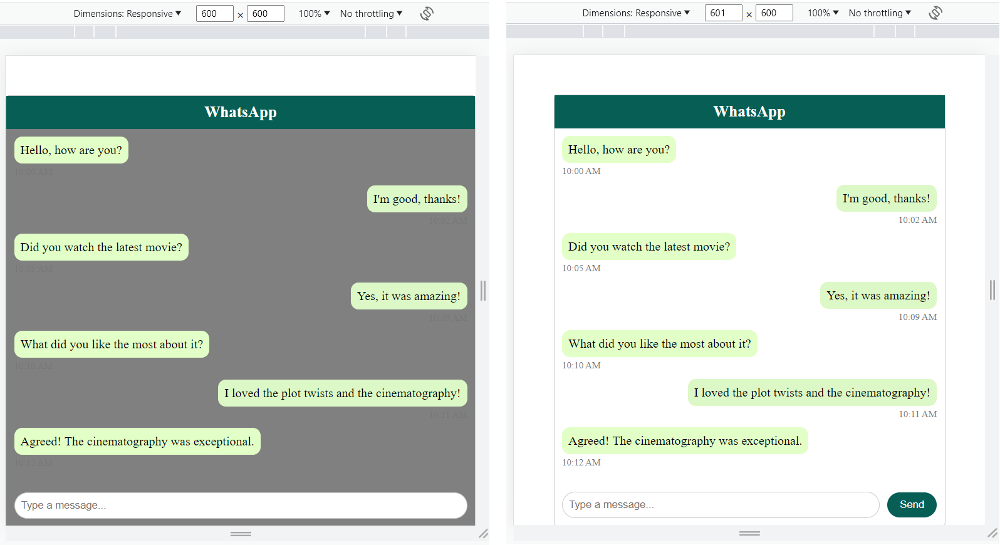

WhatsApp Chat
Description

WhatsApp Chat 

Objective:

To work with CSS Selectors, Combinators, Responsive Web Design(RWD), and Flexbox.

Problem Description:
Apply styles to the web page with a WhatsApp Chat Window, that has already been created for you,
adhering to the requirements specified.  

# Selectors and Combinators

## Constraints

| Selectors and Combinators                                | Constraints                                                                 |
|----------------------------------------------------------|-----------------------------------------------------------------------------|
| **Class Selector**  
`.message_incoming`  `.message_outgoing`          | To the elements with message_incoming class, set the alignment of flex items along the start of the vertical axis.To the elements with message_outgoing class, set the alignment of flex items along the end of the vertical axis.                     |
| **Child Selector**  `.chat_body > .message_incoming` `.chat_body > .message_outgoing`  | Set the display property of the elements with these 2 classes to flex, to enable flexbox layout. Set the direction of the flex containers' main axis to column.Set their margin-bottom property to 10px,so that the bottom of each message container will have some spacing between messages.   |                       
| **Space Selector** `.message_incoming .message_text` `.message_outgoing .message_text` | Elements with message_text class within elements with message_incoming class  must be set with the background color : `#e2ffc7`. Elements with message_text class within  elements with message_outgoing class  must be set with the background color : `#dcf8c6`. |
| **Adjacent Sibling Selector** `.message_text + .message_timestamp` | The adjacent sibling selector `( + )` must target the timestamp element that immediately follows the message text element. Set the font size to 12 pixels,  color to `#777777`, and top margin to 4 pixels.       |
| **Class Selector**  `.chat_footer` `.message_input`                | Set the display property of the element with class `chat_footer` to flex, to enable flexbox layout, and align the items in it to the center. Set the flex-grow property of the element with class `message_input` to 1.This will flex item to grow and fill available space along the main axis of the flex container.                           |
| **Media Query (Max Width 600px)** `.chat_footer` `.send_button`          | To the element with class `chat_footer`, set the direction of the flex containers' main axis to column.Align the element with class send_button  to the center of its container element, which is typically the chat footer.   |

Web page after applying all the styles will look like below :

