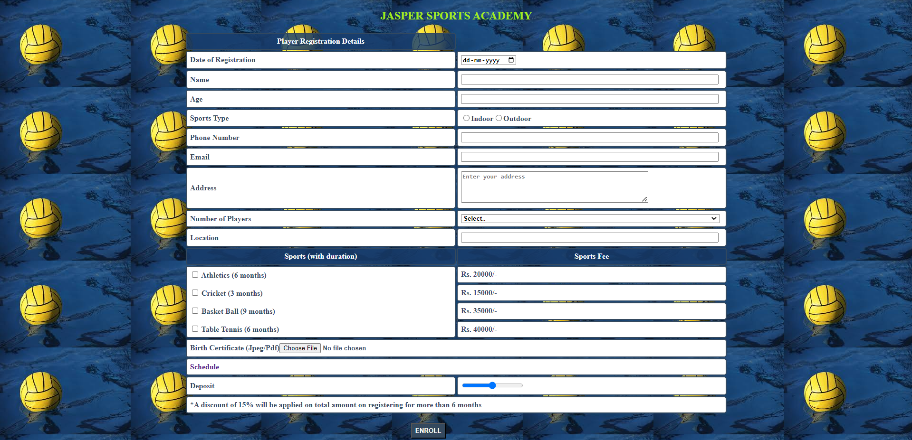
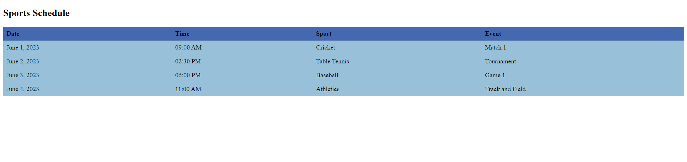

# Jasper Sports Academy
## Description

### Objective:

To work with HTML5 Form Elements.

#### Problem Description:

Jasper Sports Academy is a recently started sports academy in the city. They would like to design the web page for their academy to register online for the new enrollments and the offers provided to attract the people.Help them in designing a web page towards the same, referring to the screenshot given below.

Use the Label Name and the element Id as given. All the necessary attributes for the element should be given. The element Id should be specified for each HTML element. All Tags, Elements and Attributes should conform to HTML5 standards.

**Front page:**

**timing.html page while clicking schedule:**

**Design the web page "JASPER SPORTS ACADEMY" with specified fields and the constraints specified in the table below:**

| Label Name                | Element Id (Specify it for the "id" attribute) | Description                                                                                                     |
|---------------------------|-----------------------------------------------|-----------------------------------------------------------------------------------------------------------------|
| Player Registration Details|                                              |                                                                                                                 |
| Date of Registration      | dateReg                                       | To enter the registration date. Design Constraints: Provide the correct input type to make this component accept a date. The Component should be mandatory. |
| Name                      | pname                                         | To enter the name of the student. Design Constraints: Use "text" type input with the pattern attribute that accepts only alphabets and spaces. The Component should be mandatory. |
| Age                       | age                                           | To enter the age. Design Constraints: Use "number" type input. Set the "min" age required as 3. The component is mandatory. |
| Sports Type               | indoor, outdoor                               | To select the sports type. Design Constraints: The option values pertaining to the sports type are 'Indoor' and 'Outdoor'. The name of radio button pertaining to all the options is 'sportsType'. |
| Phone Number              | phNumber                                      | To enter the phone number. Design Constraints: Use "tel" type input. Use the "pattern" attribute to accept the 10-digit mobile number to start with either of the following numbers: 6, 7, 8, or 9. The component is mandatory. |
| Email                     | mail                                          | To enter the email id. Design Constraints: Use the "email" type input. The component is mandatory.                |
| Address                   | address                                       | To enter the address. Design Constraints: The text "Enter your address" should appear by default. Provide the correct tag and attributes to create a text area with "4" rows and "50" columns. It should be mandatory. |
| Number of Players         | players                                       | To select the number of players. Design Constraints: The option values pertaining to educational qualification are '--Select--', 'Single', 'Double', 'Multiple'. |
| Location                  | location                                      | To specify the location. Design Constraints: Mandatory component with "text" type input.                         |
| Sports (with duration) & Sports Fee | choice1, choice2, choice3, choice4 | To select the courses. Design Constraints: The names of checkboxes pertaining to all the options is 'sports' and their values (in the order of checkboxes) are as follows: "Athletics (6 months)", "Cricket (3 months)", "Basket Ball (9 months)", "Table Tennis (6 months)". |
| Birth Certificate (Jpeg/Pdf) | dob                                       | To upload birth certificate. Design Constraints: Provide the correct input type to make this component accept an image of type jpeg or pdf file format only. It should be mandatory. |
| Schedule                  | schedule                                      | Create an anchor tag with the given id and give a hypertext reference to "timing.html". While clicking this it should redirect to the timing.html page. |
| Deposit                   | deposit                                       | To specify the deposit. Design Constraints: Provide the correct input type to make this component a range slider with min value 10000 and max value 20000. It should be mandatory. |
| discountAmt               |                                               | A discount of 15% will be applied on the total amount on registering for more than 6 months must be the table data, holding title with value: "Only on registration for more than 6 months". |
| Enroll                    | enroll                                        | Submit button to submit the page. Design Constraints: The input type should be "submit" and the value should be "ENROLL". It is clickable but has no action associated with it. |
| timing.html                    | TableCreate a table in the `timing.html` page with the following table head and table data given in the screenshot. |

**NOTE: The text highlighted in bold in the Description needs to be implemented in the code to complete the web page design.**

#### IMPORTANT constraints on components:
1. Every table row has 2 table data except `"Player Registration Details" & "the last table data"` containing a statement on discount - whose tds span across 2 columns.
2. Apply class : 'title'(given) to table data (td) containing : `Player Registration Details, Sports (with duration) & Sports Fee`.
3. Partially filled table row pertaining to `Sports (with duration) & Sports Fee` is given in the template.

 
