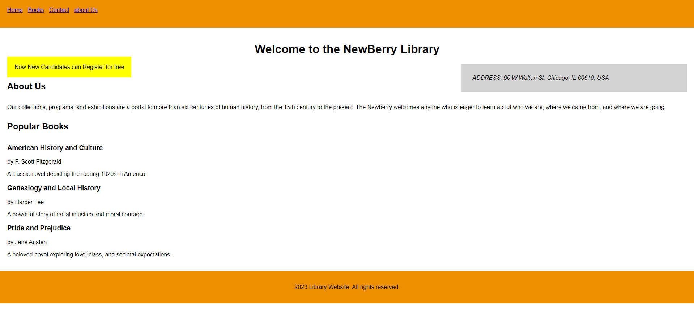

# NewBerry Library

## Description

### Objective:

To work with HTML5 Semantic Tags.

#### Problem Description:

One of the well-known libraries is the NewBerry Library. They have made the decision to build a website where they would advertise the notable books they have in their library.Aid them in developing a site.
 

**Create elements AS PER THE ORDER specified in the table given below:**

| Element Id   | Description                                                                                              |
|--------------|----------------------------------------------------------------------------------------------------------|
| head         | Create a HEADER element for the page using the header tag with the given id. The header should contain the navigation tag inside it. |
| navigation   | Create a navigation bar with the given id. Inside this should have 4 anchor tags such as Home, Books, Contact, About Us. |
| heading1     | Inside the Main, create a H1 tag with id `heading1` and inside it type "Welcome to the NewBerry Library". |
| address      | Inside the Main, create aside using the given id and type "ADDRESS: 60 W Walton St, Chicago, IL 60610, USA". |
| about        | Create a section with given id. Inside that create `offer`, `heading2`, and `about_us`.                   |
| offer        | Set "Now New Candidates can Register for free" as mark using given id.                                    |
| heading2     | Set "About Us" in h2 tag using given tag.                                                                |
| about_us     | Create a paragraph tag using given id and type the content as shown in the screenshot.                    |
| books        | Create a section for the given id. Inside this set "Popular Books" inside a h2 tag. Create `book1`, `book2`, `book3` inside this section. |
| book1        | Create an article with the given id. Set "American History and Culture" in h3 tag with id `bookName1`. Set "by F. Scott Fitzgerald" in paragraph tag. In the next paragraph tag, set "A classic novel depicting the roaring 1920s in America." |
| book2        | Create an article with the given id. Set "Genealogy and Local History" in h3 tag with id `bookName2`. Set "by Harper Lee" in paragraph tag. In the next paragraph tag, set "A powerful story of racial injustice and moral courage." |
| book3        | Create an article with the given id. Set "Pride and Prejudice" in h3 tag with id `bookName3`. Set "by Jane Austen" in paragraph tag. In the next paragraph tag, set "A beloved novel exploring love, class, and societal expectations." |
| foot         | Within the footer tag, create the short footer-text: "2023 Library Website. All rights reserved." within the paragraph tag with id `copyright`. |
