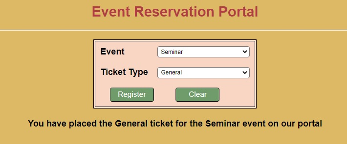

Description
Event Reservation Portal

Objective:

To work with JavaScript DOM manipulation, event handling, dynamic dropdown generation, and form submission.

Problem Description:

"Event Reservation Portal" is a newly started social service agency organizing a ticket Reservation camp in the city. They need to get the required ticket count to plan and organize the ticket Reservation camp. For this requirement, they require an Events enrollment portal to make people enroll themselves for a ticket Reservation camp by selecting an appropriate event and its tickets. Since there are various events &various types of tickets for each events, they want an optimized web page design using JavaScript.

As a part of this portal, the web page is already created with the required HTML components. Using JavaScript, generate the options of one drop-down based on the selected option of another dropdown.   

Requirement: Populate the ticket dropdown based on the events dropdown and display the enrollment acknowledgment message on successful registration.

When the user selects the event (from a dropdown) for which he/she would like to get ticket, then the tickets relevant to that events alone must get displayed in the ticket's dropdown. For tickets list and events name, please refer to the Data Chart-1 given below.

 

# Data Chart-1:

# Event Types and Ticket Lists

| Event    | Ticket List                                            |
|----------|---------------------------------------------------------|
| Conference | - "Standard"                                           |
|           | - "VIP"                                                |
| Workshop  | - "Beginner"                                           |
|           | - "Intermediate"                                       |
|           | - "Advanced"                                           |
| Seminar   | - "General"                                            |
|           | - "Student"                                            |
| Webinar   | - "Free"                                               |
|           | - "Paid"                                               |

 

# Following are the files that contain code snippets:

| index.html | HTML for webpage (complete implementation is given). You only have to run this. No change needs to be done in this file.|
| script.js  | Add your code to this file for the functions given.|

Procedure to complete the exercise: In `script.js`, provide the implementation for the functions as per the requirements mentioned below.

| `eventOnChange()`      | This method should load the ticket type drop down list according to the value selected from the Event drop down list as provided in the Data Chart-1. |
|                        | Example: Beginner, Intermediate and Advanced must be the options for ticket type dropdown when "Workshop" is selected in the Event selection dropdown. |
| `registerEvent()`      | This function should display a message in the div component `result` after submitting the request.   |
|                        | 1. If no selection has been made from both (or) one of the dropdown list, then the div tag with id `result` should display the following message: "Select values from all dropdown menus"              |
|                        | 2. When both dropdown list values are selected, then the message must be are as follows: "You have placed the <ticket> ticket for the <event>  event  on our portal" |

Screenshots
(i) Plain webpage:

(ii) On selecting Workshop, the ticket type relevant to workshop is populated:

(iii) On selecting both dropdowns

(iv) When either one or both dropdowns are missing

