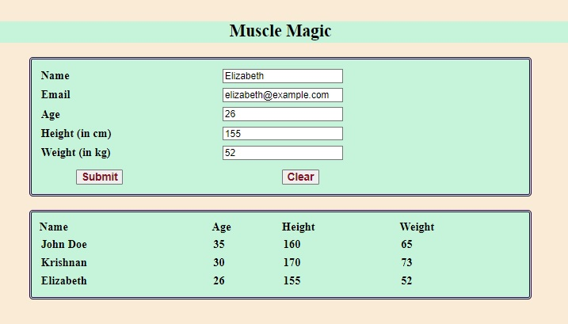

# Fitness Centre
## Description

### Objective:

To work with object creation, manipulation of arrays, and DOM elements.

#### Problem Description:

Muscle Magic is a popular fitness centre. In order to track client data, they created an HTML page. They require Javascript methods to do that in order to store customer data in an array. As a software consultant, help them to preserve their customer detail using Javascript

You are given with a web page that contains

- Text box with name as input
- Text box with email as input
- 3 number boxes with age, height, and weight as inputs
These are provided in the template. Use your JavaScript skills to print the result.

**Following are the files that contain code snippets:**

`index.html` - HTML for webpage (complete implementation is given). You only have to run this. No change needs to be done to this file
`script.js` - Add your code to this file for the functions given. 

`Procedure to complete the exercise`: The required function headers are already available in the JavaScript file - script.js. DO NOT change the function names. Fill the following functions with the required code.

**Note : In order to obtain multiple inputs, declare the array globally.**

| Function          | Description                                                                                             | Steps                                                                                                                             |
|-------------------|---------------------------------------------------------------------------------------------------------|-----------------------------------------------------------------------------------------------------------------------------------|
| `display()`       | On Clicking the 'Submit' button, this function is invoked (already given). Retrieve the name, age, height, and weight using DOM element values. | 1. Retrieve the name, age, height, and weight using DOM element values.                                                            |
|                   |                                                                                                         | 2. Invoke the `createObject(name, age, height, weight)` function and retrieve the result.                                        |
|                   |                                                                                                         | 3. Invoke the `addArray(result)` function with the returned value of `createObject` as an argument and retrieve the result.      |
|                   |                                                                                                         | 4. Iterate the array and display the values in tabular format in the div with id "result" using `innerHTML`.                     |
|                   |                                                                                                         | 5. Use the 'table' value in the class attribute of the output table for styling.                                                 |
| `createObject()`  | By using its parameters, this method should create an object and return the same.                       | 1. Parameters: `name`, `age`, `height`, `weight`.                                                                                |
|                   |                                                                                                         | 2. The object should have properties: `name`, `age`, `height`, and `weight`.                                                     |
| `addArray(obj)`   | This method should add the object to the array (obj_array [Already provided in the template]) and return the obj_array. | 1. Add the object to `obj_array`.                                                                                                 |
|                   |                                                                                                         | 2. Return `obj_array`.                                                                                                           |

**Screenshot :**

**Note:**

In JavaScript, use getElementById() to retrieve the values of the HTML components.

Do not use jQuery (or) ES6 features. 
