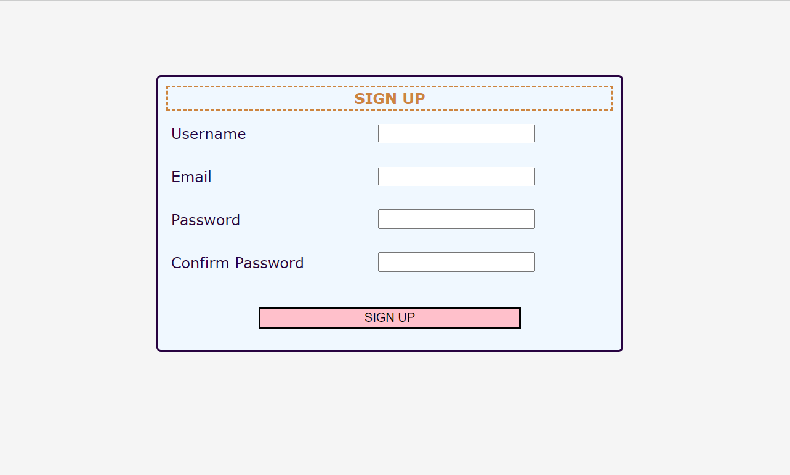
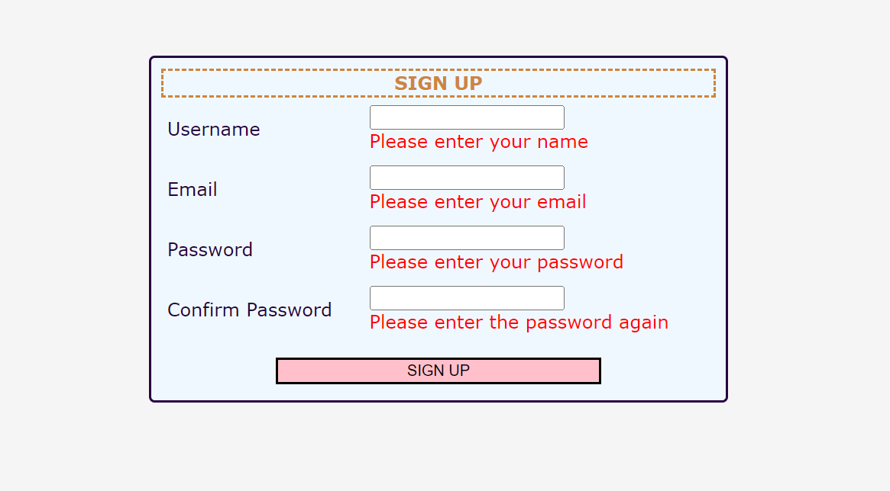
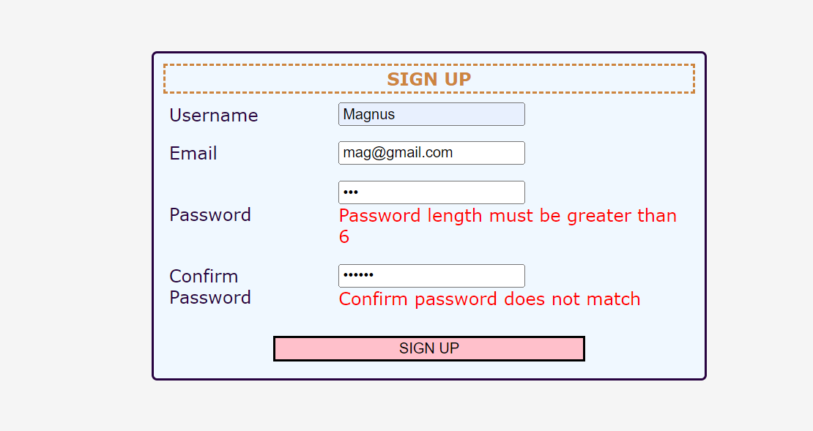

Description

Sign Up Form

Objective:

To work with JavaScript Form Validation.

Problem Description:

Regina created a Sign Up form using HTML but she don't know to validate the form using JavaScript. Help her to validate the form using JavaScript.

You are given with a web page that contains

-        a text box with name as input

-        a text box with email as input

-        a text box with password as input

-        a text box with confirm password as input

These are provided in the template. Use your JavaScript skills to validate the form.

Following are the files that contain code snippets
index.html - HTML for webpage (complete implementation is given). You only have to run this. No change needs to be done to this file
script.js - Add your code to this file for the functions given. 

Procedure to complete the exercise: The required function headers are already available in the JavaScript file - script.js. DO NOT change the function names. Fill the following functions with the required code.

|                     |On Clicking the `Sign Up` button, this function is invoked (already given), this function should validate the Sign Up form.|
|                     |Fetch the name, email, password, confirm password using the components ids.|
|validate()           | If the name is empty, display the statement "Please enter your name" in the span with id `namelocation`.|
|                     |If the email is empty, display the statement "Please enter your email" in the span with id `emaillocation`.|
|                     |If the password is empty, display the statement "Please enter your password" in the span with id `passwordlocation`.|
|                     |If the password length is less than 6, display the statement "Password length must be greater than 6" in the span with id `passwordlocation`.|
|                     |If the confirm password is empty, display the statement "Please enter the password again" in the span with id `confirmlocation`.|
|                     |If the confirm password is not equal to  password, display the statement "Confirm password does not match" in the span with id `confirmlocation`.|

Screenshot1 :

Screenshot2 : After clicking signup button

Screenshot3: validation for password and confirm password

Note:
In js, use the getElementById() function to retrieve the value of the html component. Do not use Jquery and ES6 features.
 
